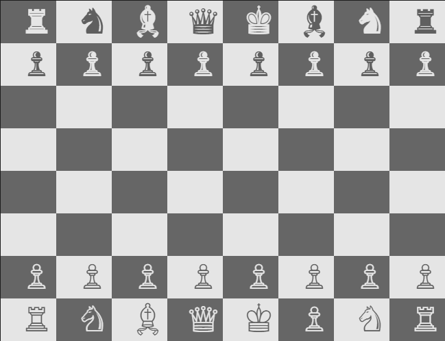

[](https://classroom.github.com/a/a8C-h-dG)
# Chess [Short Algebraic Notation (SAN)](https://en.wikipedia.org/wiki/Algebraic_notation_(chess)#Notation_for_moves)

## Introduction

Your job is to decipher and explain chess moves in [Short Algebraic Notation (SAN)](https://en.wikipedia.org/wiki/Algebraic_notation_(chess)#Notation_for_moves). First, read the Wikipedia article about SAN and make yourself familiar with the concept.

Write a console app that receives the moves of a published chess game as command-line arguments. Example:

```txt
dotnet run e4 e5 Bc4 Nc6 Qh5 Nf6 Qxf7#
```

You have to decipher the moves according to the rules shown below and print the descriptions of the moves on the screen.

```txt
Pawn (♙) moves to e4
Pawn (♙) moves to e5
Bishop (♗) moves to c4
Knight (♘) moves to c6
Queen (♕) moves to h5
Knight (♘) moves to f6
Queen (♕) captures the piece on f7, checkmate
```

## Level 1 - Moves

| Input | Output                 |
| ----- | ---------------------- |
| Be5   | Bishop (♗) moves to e5 |
| Nf3   | Knight (♘) moves to f3 |
| c5    | Pawn (♙) moves to c5   |

## Level 2 - Captures

Everything of level 1 plus:

| Input     | Output                                                            |
| --------- | ----------------------------------------------------------------- |
| Bxe5      | Bishop (♗) captures the piece on e5                               |
| exd5      | Pawn (♙) on the e-file captures the piece on d5                   |
| exd6 e.p. | Pawn (♙) on the e-file captures a piece en passant and goes to d6 |

## Level 3 - Disambiguating Moves

| Input | Output                             |
| ----- | ---------------------------------- |
| Rdf8  | Rook (♖) on the d-file moves to f8 |
| R1a3  | Rook (♖) on the 1-rank moves to a3 |
| Qh4e1 | Queen (♕) on h4 moves to e1        |

## Level 4 - Pawn Promotion

| Input | Output                                            |
| ----- | ------------------------------------------------- |
| e8Q   | Pawn (♙) moves to e8 and is promoted to Queen (♕) |

## Level 5 - Special Cases

| Input | Output                                                        |
| ----- | ------------------------------------------------------------- |
| 0-0   | Kingside castling                                             |
| 0-0-0 | Queenside castling                                            |
| Be5+  | Bishop (♗) moves to e5 and places opponents King (♔) in check |
| Be5#  | Bishop (♗) moves to e5, checkmate                             |

## Level 6 - Hard ⚠️

After each described move, display the current state of the chessboard e.g. like this:



Here are the chess pieces as copyable characters:

```cs
char[] blackPieces = { '♜', '♞', '♝', '♛', '♚', '♟' };
char[] whitePieces = { '♖', '♘', '♗', '♕', '♔', '♙' };
```
